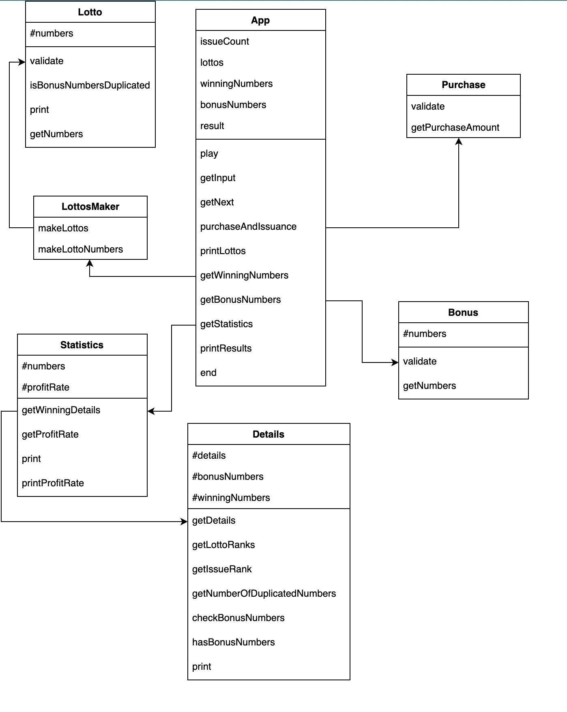
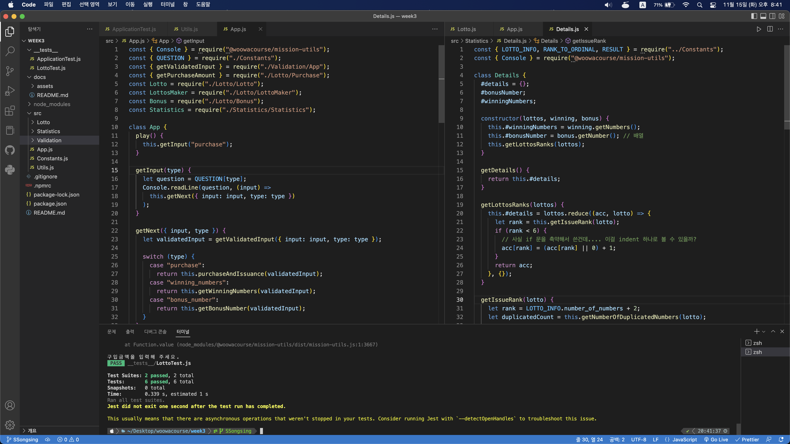

# 🤑 로또

> 우아한 테크코스 프리코스 - week 3

## 📑 개요

원하는 금액 및 당첨 번호를 입력하면 당첨 결과 및 수익률을 출력하는 프로그램

## ✨ 주요 기능

### 자동으로 번호 선택


- 금액을 입력하면 자동으로 해당 금액으로 살 수 있는 매수만큼 번호를 선택하고 번호를 알려준다.

### 당첨 번호 입력


- 사용자는 보너스 번호를 포함한 당첨 번호를 입력할 수 있다.

### 통계


사용자가 발행한 로또들의 당첨 내역 및 수익률을 출력한다.

## 🖋 기능목록

- [x] 1. 로또 구입 금액을 입력 받기
  - 예외처리: 1000원으로 나누어 떨어지지 않는 경우, 형식에 맞는 입력!
- [x] 2. 구입 금액에 해당하는 만큼 로또 발행
- [x] 3. 발행한 로또 번호들을 오름차순으로 정렬한 후 발행한 로또 번호 및 수량 출력
- [x] 4. 당첨 번호 및 보너스 번호 입력 받기 (6+1)
  - 예외처리:
    - 6자리 숫자
    - 쉼표 구분
    - 중복 X
    - 보너스 번호도 winning number 와 노중복이어야 한다
    - 형식에 맞는 입력
- [x] 5. 입력 받은 번호와 발행한 로또들을 비교하여 당첨 내역 및 수익률 출력
  - 수익률은 소수점 둘째 자리에서 반올림한다.
  - 확인용 객체 따로 선언

## 🎯 단위 테스트

**Application**

- [x] lotto - 형식(숫자,숫자,숫자)에 위배되는 입력이 들어온 경우

**Lotto**

- [x] 범위를 벗어나는 경우 테스트
- [x] getNumbers() 함수 테스트

**Bonus**

- [x] 범위를 벗어나는 경우
- [x] 앞서 정한 로또 숫자들과 중복되는 경우
- [x] 숫자가 한 개보다 많이 들어온 경우

**Details**

- [x] getDetails() 테스트

**Statistics**

- [x] print() 테스트

## 📃 클래스 구성



## 🛎 소감 및 메모

### 🎉 소감


~~3주차를 가장 잘 나타내는...~~

많이 배운만큼 아쉬운 한 주였다. 정확히는 삽질하느라 많이 배웠다. 브랜치 안 딴 상태에서 push 하는 바보짓을 했고 복구하는 과정해서 17커밋을 날리는 치명적인 실수도 했다.🫠 더하여 테스트를 진행하는데 저번 주에도 또! 나타냈던 오류가 나서 어케든 잡으려고 했는데 결국 못 잡고 gg 쳤다.

#### git 브랜치를 잊지 말자!

git을 연습하기 위해 혼자서 소소하게 쓰다보니 branch 따서 일하는 것을 잊었다. 1차 완성을 하고 야심차게 push 를 했을 때 이상함을 깨달았으나 이미 fork 해온 메인 브랜치에 푸쉬하고 난 이후였다. 어떻게든 되돌리려고 애썼고 애쓰는 과정에 stash 한 내용들을 날려버렸다. 복구할 수 있다는데 코드를 따라쳐도 나는 복구가 안 됐다.🤯 성공적이지 않더라도 궁금하던 `git stash`를 사용해봐서 나름 의미있는 경험이었다...ㅎ

#### 설계를 먼저..

나는 구현을 하면서 구조를 짜게 되면 과부하가 와서 아예 생각을 못한다. 근데 또 구현을 안하면 구조에 대해 감이 안 잡히기도 한다. 그래서 매번 용감하게 구현을 시작하고 반절쯤 갔을때 간단한 설계라도 미리할 걸 후회한다. 이전 과제들은 구조가 까다롭지 않아서 그래도 괜찮았는데 요번에는 클래스를 최대한 활용하면 좋았던 과제라 미리 설계할 걸 아쉬움이 남았다.

#### 테스트!!!

리팩토링을 하면서 단위 테스트를 (나름) 활용해보았다. 코드를 바꾸고 처음부터 모든 과정을 다시 진행할 필요 없이 바로 확인할 수 있어 매우 편리했다! 프로그램을 모두 완료하고 테스트를 진행할 필요 없이 구현 중에도 테스트코드를 작성하고 코드를 추가할 때마다 테스트를 돌려 올바른지 확인하면 시간 절약도 되고 유용할 것 같다. 다음 주차에는 꼭 구현 중에 단위 테스트를 진행해야겠다. 그치만 편리한만큼 날 힘들게 만들기도 했다.


`Console`에서 발생하는 것까지는 알겠는데 도저히 어떤 파트에서 나는지 모르겠던 오류였다. 검색하여 찾은 해결책이 package.json 파일을 건드는 것이라 시도해보지 못했다. 어이없는 부분은 코드 바뀐 부분이 없는데 오류가 났다가 안 났다가 해서 내 문제가 아니라고 생각하면서 넘겼다.

#### 다음 과제 다짐

- 설계를 꼭 먼저하겠다.
- 구현에 정신 팔려서 맨날 메모랑 링크만 남겨두고 배운 내용을 못 정리했는데 하면서 해야겠다.
- 한 파일에 100줄 이하 및 3 이하 들여쓰기는 지켰는데 파일 라인 수를 더 줄여보겠다.(더 쪼개야지)

### 메모

#### 2주차 피드백 후기

2주차 피드백을 보고서 3주차때 개선할 점이 많다는 사실을 깨달았다.

- 기능 목록 재검토, 업데이트
- 값을 하드코딩하지 않는다!
- 한 함수가 한 가지 기능만 담당하게 한다 - 한 함수에서 안내 문구 출력, 사용자 입력, 유효값 검증 등 여러 일을 하고 있다면 이를 적절하게 분리
- 한 함수가 한 가지 기능을 하는지 **확인하는 기준**을 세운다
- 작은 단위의 테스트

2주차 과제를 작성하면서 이렇게 해도 될까 의문은 들었지만 시간 없다는 핑계로 넘어갔던 부분들이었는데 피드백에 있어서 부끄러웠다. 그래도 궁금했던 부분들에 대해 명쾌한 답을 들은 것 같아서 3주차 과제에서 지키는 것이 목표이다.

#### 고민

- 객체를 어떤 단위로 나눠야할까?
  - input을 받는 것은 app 객체에서 받지만 처리는 이제 다른 객체로 보내야하나?
- constants 명을 최대한 상세히 가져가는 게 좋을까?
- readline을 동기로 가져가고 싶다... => https://stackoverflow.com/questions/43638105/how-to-get-synchronous-readline-or-simulate-it-using-async-in-nodejs readline을 쌩으로 쓰면 가져갈 수도?
- 객체 사용법을 진짜 모르겠음ㅜㅜㅜ어렵다
- 유효성 검사에서 함수를 따로 빼는데 이때 에러도 같이 뺄지 고민 중
- 정규식 어렵다! string 이 통째로 만족하는 경우 찾는 중
  https://stackoverflow.com/questions/6448573/regular-expression-help-comma-delimited-string
- 콘솔창이 안 닫혀서 놀랐는데 mission-utils 때문에 그렇다는 사실을 깨닫고 안심햇다.
- class 선언 순서

#### 배운 내용

- 다른 분들에게 피어 리뷰를 부탁하진 못했지만😂 프리코스에 참여하신 분들이 서로 리뷰하신 내역을 많이 참고했다! 그 중에서도 1주차 피드백 내용에도 있던 EOL(End Of Line) 설정을 놓쳤다는 것을 깨달았다. 피드백을 꼼꼼히 읽었어야 하는데 실수했다.
- https://poiemaweb.com/js-prototype - 프로토타입 사용하려면 어케 써야하는가~
  - https://developer.mozilla.org/en-US/docs/Web/JavaScript/Reference/Errors/Not_a_constructor
- switch - case 의 default 사용법.
- new Error() Error() 차이 https://stackoverflow.com/questions/9156176/what-is-the-difference-between-throw-new-error-and-throw-someobject

#### JEST

> https://inpa.tistory.com/entry/JEST-%F0%9F%93%9A-%EB%AA%A8%ED%82%B9-mocking-jestfn-jestspyOn

부끄럽게도 이전 주차에 jest 공부를 못해서 요번 주에 함.
**Mocking 메소드**

-`jest.fn()`: 가짜 함수를 생성해줌. 이를 사용하면 일회성 테스트용으로 내부의 함수를 진짜 같이 구동 가능하다. 함수면 값을 반환해줄텐데 `.mockReturnValue(value)`를 사용하여 반환 값을 지정할 수 있다.

```javascript
const mockFn = jest.fn();
mockFn.mockReturnValue("give me RETURN!");
mockFn(); // give me RETURN!
```

- `mockImplementaion(value)`: 위에서 지정한 모크 함수는 아무것도 안 들어있는데, 이를 통해 모크 함수를 즉석으로 구현할 수 있다.

```javascript
mockFn.mockImplementaion((name) => `I am ${name}!`);
console.log(mockFn("ME")); // I am ME!
```
