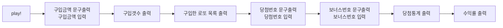

# 로또 기능 목록

## 🚀 기능 목록

- [x] 구입금액문구 출력 및 입력 `run` 및 `purchase`
- [x] 구입 갯수 출력 `purchase`의 `LottoIssuer` 클래스
  - [x] 구입 금액 1000원 당 로또 발행 1회이다.
- [x] 구입한 로또 목록 출력
  - [x] 1~45까지의 중복되지 않는 6자리의 숫자를 발행 횟수만큼 뽑는다. `issue`
  - [x] 로또 발행 횟수 만큼 로또 번호 목록을 출력한다. `printLottoNumbers`
- [x] 당첨번호 문구 출력 및 입력 `drawWinningNumbers`
- [x] 보너스번호 문구 출력 및 입력 `drawBonusNumber`
  - `Lotto` 클래스에 번호 저장
- [x] 당첨통계 출력 `LottoResult` 클래스
  - [x] 당첨번호와 뽑은 로또를 비교해 중복 횟수를 구한다. `calculateMatching`
  - [x] 구입금액과 당첨금액을 활용해 수익률을 구한다. `calculateProfitRate`
  - [x] 당첨 데이터를 바탕으로 당첨 통계를 출력한다. `printResult`
- [x] App 클래스 play 메서드 구현

예외 사항을 검사하는 클래스 만들기

- [x] 로또 관련 예외사항을 담는 `LottoValidation` 클래스

- [x] 구입금액 입력 `Payment`
  - [x] 입력값은 숫자다.
  - [x] 단위가 1000으로 떨어져야한다.
  - [x] 금액 0원은 입력할 수 없다.
- [x] 당첨번호 입력 `Lotto`
  - [x] 번호는 1~45의 숫자다.
  - [x] 각 번호의 구분을 `,`로 한다.
  - [x] 번호가 중복되면 안된다.
- 보너스번호 입력 `LottoBonus`
  - [x] 번호는 1~45의 숫자다.
  - [x] 번호가 당첨번호와 중복되면 안된다.

테스트 코드 작성하기

`LottoGame` 테스트의 경우 ApplicationTest로 대체하였다.

- [x] 유효성 검사 클래스 테스트
  - [x] 모든 메서드를 테스트 하였는가?
- [x] 각 클래스에 대해 테스트
  - [x] `Payment`
  - [x] `Lotto`
  - [x] `LottoBonus`
  - [x] `LottoIssuer`
  - [ ] `LottoResult`
  - [x] `LottoValidation`

리펙토링

- [x] 로또를 발행하는 로직 클래스화 `LottoIssuer`
- [x] 로또 당첨 통계 계산 및 출력 로직 클래스화 `LottoResult`
- [x] `Lotto`클래스에 `LottoBonus` 클래스 활용
- [x] `LottoGame` 클래스 생성자 제거 후 프라이빗 필드 추가
  - [x] 이에 따른 `LottoGame`에 종속된 클래스 변경
- [x] 상수 분리하기

---

## 흐름 파악

예외 사항은 일단 배제하였다.



흐름에 따른 기능을 나열하면 다음과 같다.

- 구입금액문구 출력 및 입력
- 구입 갯수 출력
- 구입한 로또 목록 출력
- 당첨번호 문구 출력 및 입력
- 보너스번호 문구 출력 및 입력
- 당첨통계 출력

각 과정에서 필요한 기능을 추가한다.

- 구입금액문구 출력 및 입력
- 구입 갯수 출력
  - 구입 금액 1000원 당 로또 발행 1회이다.
- 구입한 로또 목록 출력
  - 1~45까지의 중복되지 않는 6자리의 숫자를 발행 횟수만큼 뽑는다.
  - 로또 발행 횟수 만큼 로또 번호 목록을 출력한다.
- 당첨번호 문구 출력 및 입력
- 보너스번호 문구 출력 및 입력
- 당첨통계 출력
  - 당첨번호와 뽑은 로또를 비교해 당첨 데이터를 구한다.
  - 당첨 데이터를 바탕으로 당첨 통계를 출력한다.
- 수익률 출력
  - 구입금액과 당첨금액을 활용해 수익률을 구해 출력한다.

## 예외 사항 생각하기

입력값이 들어올 때 유효성을 확인하고 이에 대해 예외가 있는지 확인해야한다.

로또 기능 구현에 있어서 입력값을 받는 경우를 정리해 보았다.

- 구입금액 입력
- 당첨번호 입력
- 보너스번호 입력

입력에 대한 조건을 추가해보았다.

- 공통 조건
  - 입력값은 숫자다.
- 구입금액 입력
  - 단위가 1000으로 떨어져야한다.
- 당첨번호 입력
  - 각 번호의 구분을 `,`로 한다.
  - 번호는 1~45의 숫자다.
  - 번호가 중복되면 안된다.
- 보너스번호 입력

  - 번호는 1~45의 숫자다.
  - 번호가 당첨번호와 중복되면 안된다.

- 이 3개의 입력받는 기능에 대해서 클래스로 분리한다.
- 각각의 클래스는 입력값을 받아 유효성을 검사하고 다시 반환한다.
- 각각 받은 입력값에 대해 `#` prefix를 적용한다.

### 테스트 코드 작성하기

단위 테스트

- 각 클래스에 작성한 validate메서드의 로직을 분리한다.
- 각 유효성에 대해 단위 테스트를 진행한다.

각 클래스를 검사하는 테스트 코드가 필요하다.

- 각 클래스에 대한 테스트를 진행한다.

## 기능 세부 사항

- 구입한 로또 목록 출력

  - 1~45까지의 중복되지 않는 6자리의 숫자를 발행 횟수만큼 뽑는다. `issue`
    - `MissionUtils`라이브러리에서 제공하는 `Random.pickUniueNumbersInRange`를 활용한다.
    - 생성자에 `purchaseList`를 추가하고 로또 번호를 이 리스트에 담는다.
  - 로또 발행 횟수 만큼 로또 번호 목록을 출력한다. `printLottoNumbers`
    - `forEach`를 활용해 구매한 모든 로또 번호를 출력한다.
    - 요구한 출력 형식을 맞추기 위해 출력 형식은 `[${lottoNumbers.join(', ')}]`와 같이 한다.

- 당첨 번호 입력

  - 생성자에 당첨 번호와 보너스 번호를 담는 객체 `winningNumber`를 추가한다.
  - `winningNumber`는 메인 당첨 번호를 담는 `main`과 보너스 번호를 담는 `bonus`로 이루어져 있다.
    - `winningNumber = { main: [], bonus: [] }`
  - 당첨 번호를 가져오기 위해서 lotto 클래스를 활용한다.
    - lotto 클래스에서 번호를 가져오기 위한 메서드 `getNumbers`를 추가한다.
    - lotto 클래스의 `validate`에서 중복성 검사를 하는 로직을 추가한다.

- 당첨통계 출력
  - 생성자에 당첨 데이터를 저장하기 위한 객체를 추가한다. 다음과 같은 정보를 포함해야한다.
    - 각 로또마다 맞은 번호 갯수
      - 5개를 맞은 경우 보너스 번호를 검사해 2등 판별
    - 로또를 통해 얻은 금액
    - 수익률

```
  constructor() {
    this.profitRate = 0;
    this.lottoMatchCounter = {
      three: 0,
      four: 0,
      five: 0,
      fiveWithBonus: 0,
      six: 0,
      out: 0,
    };
  }
```

- 당첨번호와 구매한 로또를 비교해 매칭 데이터를 구한다. `countMatching`
  - 구매한 로또를 한개씩 확인한다.
    - 당첨 번호가 구매한 로또에 몇개 중복되는지 구한다.
    - 중복되는 갯수에 맞게 `lottoMatchCounter`에 넣는다.
      - ex) 3개가 중복되면 `lottoMatchCounter.three`을 1증가시킨다.
    - 중복되는 갯수에 따른 수입을 추가한다.
      - 이를 위해 다음 로또 상금 객체를 활용한다.

```
const LOTTO_PRIZE = {
  six: 2000000000,
  fiveWithBonus: 30000000,
  five: 1500000,
  four: 50000,
  three: 5000,
  out: 0,
};
```

- 구입금액과 당첨금액을 활용해 수익률을 구한다. `calculateProfitRate`
  - 수익률은 둘째자리에서 반올림한다.
  - 수익률은 다음 공식이 적용된다.
    - `( 얻은 금액 / 소비 금액 * 100 ) %`
- 당첨 데이터를 바탕으로 당첨 통계를 출력한다. `printResult`
  - 템플릿 리터럴을 활용한다.
