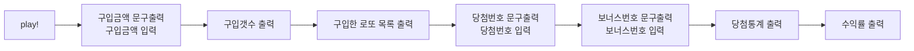

# 🎱로또 기능 목록

## 🔍목차

1. 초기 기능 목록
   1. 주 목록
   2. 예외 사항을 검사하는 클래스
   3. 테스트 코드 작성
   4. 리펙토링
2. 기능 목록 재정리 (클래스 별 기능 목록 및 흐름)
   1. `LottoGame` - 로또 게임 메인 클래스
   2. `Payment`
   3. `LottoIssuer`
   4. `Lotto`
   5. `LottoBonus`
   6. `LottoResult`
   7. `LottoValidation`
3. 미션 접근, 파악을 위해 조금씩 작성한 모든 것
   1. 흐름 파악(흐름도)
   2. 예외사항 생각하기
   3. 테스트 코드 작성하기
   4. 기능 세부 사항

---

## 🚀 기능 목록

### 주 목록

- [x] 구입금액문구 출력 및 입력 `run` 및 `purchase`
- [x] 구입 갯수 출력 `purchase`의 `LottoIssuer` 클래스
  - [x] 구입 금액 1000원 당 로또 발행 1회이다.
- [x] 구입한 로또 목록 출력
  - [x] 1~45까지의 중복되지 않는 6자리의 숫자를 발행 횟수만큼 뽑는다. `issue`
  - [x] 로또 발행 횟수 만큼 로또 번호 목록을 출력한다. `printLottoNumbers`
- [x] 당첨번호 문구 출력 및 입력 `drawWinningNumbers`
- [x] 보너스번호 문구 출력 및 입력 `drawBonusNumber`
  - `Lotto` 클래스에 번호 저장
- [x] 당첨통계 출력 `LottoResult` 클래스
  - [x] 당첨번호와 뽑은 로또를 비교해 중복 횟수를 구한다. `calculateMatching`
  - [x] 구입금액과 당첨금액을 활용해 수익률을 구한다. `calculateProfitRate`
  - [x] 당첨 데이터를 바탕으로 당첨 통계를 출력한다. `printResult`
- [x] App 클래스 play 메서드 구현

### 예외 사항을 검사하는 클래스

- [x] 로또 관련 예외사항을 담는 `LottoValidation` 클래스

- [x] 구입금액 입력 `Payment`
  - [x] 입력값은 숫자다.
  - [x] 단위가 1000으로 떨어져야한다.
  - [x] 금액 0원은 입력할 수 없다.
- [x] 당첨번호 입력 `Lotto`
  - [x] 번호는 1~45의 숫자다.
  - [x] 각 번호의 구분을 `,`로 한다.
  - [x] 번호가 중복되면 안된다.
- 보너스번호 입력 `LottoBonus`
  - [x] 번호는 1~45의 숫자다.
  - [x] 번호가 당첨번호와 중복되면 안된다.

### 테스트 코드 작성

`LottoGame` 테스트의 경우 ApplicationTest로 대체하였다.

- [x] 유효성 검사 클래스 테스트
  - [x] 모든 메서드를 테스트 하였는가?
- [x] 각 클래스에 대해 테스트
  - [x] `Payment`
  - [x] `Lotto`
  - [x] `LottoBonus`
  - [x] `LottoIssuer`
  - [x] `LottoResult`
  - [x] `LottoValidation`

### 리펙토링

- [x] 로또를 발행하는 로직 클래스화 `LottoIssuer`
- [x] 로또 당첨 통계 계산 및 출력 로직 클래스화 `LottoResult`
- [x] `Lotto`클래스에 `LottoBonus` 클래스 활용
- [x] `LottoGame` 클래스 생성자 제거 후 프라이빗 필드 추가
  - [x] 이에 따른 `LottoGame`에 종속된 클래스 변경
- [x] 상수 분리하기

---

## 🎯기능 목록 재정리 (클래스 별 기능 목록 및 흐름)

### (주 기능 담당)로또 게임을 실행하고 종료하는 클래스 `LottoGame`

- [x] `App` 클래스의 `play` 메서드로 실행한다.
- [x] `run`: 로또 게임을 실행한다.
  - [x] 구입 금액 문구를 출력한다.
  - [x] 구입 금액을 입력받는다.
- [x] `purchase` : 로또 구매 과정을 담는다.
  - [x] 지불한 돈을 관리하는 `Payment` 클래스에 입력한 구입 금액을 전달한다.
  - [x] 로또를 발행하는 `LottoIssuer` 클래스에 구매한 로또 갯수를 입력한다.
    - [x] 구입 금액 1000원 당 로또 발행 1회이다.
    - [x] `LottoIssuer.print`로 구매한 로또 목록을 출력한다.
  - [x] `drawWinningNumbers`를 실행해 로또 당첨 번호를 뽑는다.
- [x] `drawWinningNumbers`: 로또 당첨 번호를 뽑는다.
  - [x] 당첨 번호 입력 문구를 출력한다.
  - [x] 로또 당첨 번호를 담는 `Lotto`에 당첨 번호를 전달한다.
  - [x] `drawBonusNumber`을 실행해 보너스 번호를 뽑는다.
- [x] `drawBonusNumber`: 로또 보너스 번호를 뽑는다.
  - [x] 보너스 번호 입력 문구를 출력한다.
  - [x] `Lotto.setBonusNumber`로 보너스 번호를 로또 당첨 번호에 넣어준다.
  - [x] `printResult`로 로또 게임 결과를 출력한다.
- [x] `printResult`: 로또 게임 결과를 출력한다.
  - [x] `LottoResult.print`로 로또 게임 결과를 출력한다.
    - [x] 이 때 구매한 로또 번호와 당첨 번호를 활용한다.
  - [x] 더 이상 출력할 UI가 없으므로 `Console.close`로 콘솔을 닫는다.

### 지불한 돈을 관리하는 클래스 `Payment`

- [x] 생성자를 통해 지불 금액이 들어오면 `validate`메서드로 유효성을 검사한다.
  - [x] 유효성이 검증되면 `#money` 필드에 저장한다.
- [x] `validate`
  - [x] 숫자인지 검사한다.
  - [x] 값이 0인지 검사한다.
  - [x] 1000으로 나누어 떨어지는지 검사한다.
- [x] `getMoney`
  - [x] 지불 금액을 가지고 온다.

### 로또를 발행하는 클래스 `LottoIssuer`

- [x] 생성자를 통해 발행 횟수를 받고 `issue` 메서드로 발행한다.
- [x]`issue`
  - [x] 1~45의 숫자를 6번 뽑는 작업을 발행 횟수만큼 반복하면서 `#lotteries`에 넣는다.
- [x] `print`
  - [x] 구매 횟수 안내 문구를 출력한다.
  - [x] 발행한 로또를 출력한다.
- [x] `getLotteries`
  - [x] 발행한 로또를 반환한다.

### 당첨 번호를 저장하는 클래스 `Lotto`

- [x] 생성자를 통해 당첨 번호가 들어오면 `validate` 메서드로 유효성을 검사한다.
  - [x] 유효성이 검증되면 `#numbers.winning` 에 저장한다.
    - `#numbers`의 초기 구조 `{ winning: [], bonus: null }`
- [x] `validate`
  - [x] 길이가 6인지 검사한다.
  - [x] 각 숫자가 1~45의 범위에 속하는지 검사한다.
  - [x] 당첨 번호 간 중복이 있는지 검사한다.
- [x] `setBonuseNumber`
  - [x] `LottoBonus` 클래스로 입력받은 보너스 번호를 넘겨주고 유효성검사를 마친 후에 다시 받는다.
  - [x] 유효성이 검증되면 `#numbers.bonus` 에 저장한다.
- [x] `getNumbers`
  - [x] 로또 당첨 번호인 `#numbers`를 반환한다.

### 보너스 번호를 저장하는 클래스 `LottoBonus`

- [x] 생성자를 통해 보너스 번호가 들어오면 `validate` 메서드로 유효성을 검사한다.
  - [x] 유효성이 검증되면 `#number` 에 저장한다.
- [x] `validate`
  - [x] 숫자가 1~45의 범위에 속하는지 검사한다.
  - [x] 당첨 번호와 중복이 있는지 검사한다.
- [x] `getNumber`
  - [x] 보너스 번호인 `#number`를 반환한다.

### 로또 당첨 결과를 저장, 출력하는 클래스 `LottoResult`

- [x] `print`
  - [x] `countMatching`, `calculateProfitRate`을 실행한다.
  - [x] `printResult`를 실행한다.
- [x] `countMatching`
  - [x] 발행한 로또들과 당첨 번호를 비교한다.
  - [x] `getMatchCount`로 매칭 결과를 반환받는다.
    - [x] 발행한 로또와 당첨번호의 교집합을 구한 후 길이를 구해 중복 횟수를 구한다.
    - [x] 중복 횟수가 5인 경우 보너스 번호를 추가 검사한다.
  - [x] 각 매칭 결과에 맞는 `lottoMatchCounter`를 증가시킨다.
- [x] `calculateProfitRange`
  - [x] `calculateProfit` 메서드로 총 수익을 구한다.
    - [x] `lottoMatchCounter`의 요소 별 상금과 당첨 횟수를 곱한것을 누적해 반환한다.
  - [x] `총수익 / 지불한 금액 * 100`을 소수점 둘째 자리에서 반올림해 반환한다.
- [x] `printResult`
  - [x] 일치 갯수 별 당첨 횟수를 결과로 출력한다.
  - [x] 총 수익률을 결과로 출력한다.

### 로또 게임의 입력값에 대한 유효성 검사 메서드를 담는 클래스 `LottoValidation`

- [x] 모든 메서드를 `static`으로 선언
- [x] `checkLottoRange`: 로또의 6개의 숫자가 1~45의 범위에 속하는지 검사
- [x] `checkNumberRange`: 한 개의 숫자가 1~45의 범위에 속하는지 검사
- [x] `checkLength`: 로또의 길이가 6인지 검사
- [x] `checkDuplicate`: 로또 번호에 중복이 있는지 검사
- [x] `checkBonusNumberDuplicate`: 보너스 번호가 당첨 번호에 중복된 값을 가지는지 검사
- [x] `checkInputIsNumber`: 입력값이 숫자인지 검사
- [x] `checkInputIsZero`: 입력값이 0인지 검사
- [x] `checkInputDivisible`: 입력값이 인자로 받은 `divisor`로 나누어 떨어지는지 검사

---

## ✏️미션 접근, 파악을 위해 조금씩 작성한 모든 것✏️

### 흐름 파악

예외 사항은 일단 배제하였다.



흐름에 따른 기능을 나열하면 다음과 같다.

- 구입금액문구 출력 및 입력
- 구입 갯수 출력
- 구입한 로또 목록 출력
- 당첨번호 문구 출력 및 입력
- 보너스번호 문구 출력 및 입력
- 당첨통계 출력

각 과정에서 필요한 기능을 추가한다.

- 구입금액문구 출력 및 입력
- 구입 갯수 출력
  - 구입 금액 1000원 당 로또 발행 1회이다.
- 구입한 로또 목록 출력
  - 1~45까지의 중복되지 않는 6자리의 숫자를 발행 횟수만큼 뽑는다.
  - 로또 발행 횟수 만큼 로또 번호 목록을 출력한다.
- 당첨번호 문구 출력 및 입력
- 보너스번호 문구 출력 및 입력
- 당첨통계 출력
  - 당첨번호와 뽑은 로또를 비교해 당첨 데이터를 구한다.
  - 당첨 데이터를 바탕으로 당첨 통계를 출력한다.
- 수익률 출력
  - 구입금액과 당첨금액을 활용해 수익률을 구해 출력한다.

### 예외 사항 생각하기

입력값이 들어올 때 유효성을 확인하고 이에 대해 예외가 있는지 확인해야한다.

로또 기능 구현에 있어서 입력값을 받는 경우를 정리해 보았다.

- 구입금액 입력
- 당첨번호 입력
- 보너스번호 입력

입력에 대한 조건을 추가해보았다.

- 공통 조건
  - 입력값은 숫자다.
- 구입금액 입력
  - 단위가 1000으로 떨어져야한다.
- 당첨번호 입력
  - 각 번호의 구분을 `,`로 한다.
  - 번호는 1~45의 숫자다.
  - 번호가 중복되면 안된다.
- 보너스번호 입력

  - 번호는 1~45의 숫자다.
  - 번호가 당첨번호와 중복되면 안된다.

- 이 3개의 입력받는 기능에 대해서 클래스로 분리한다.
- 각각의 클래스는 입력값을 받아 유효성을 검사하고 다시 반환한다.
- 각각 받은 입력값에 대해 `#` prefix를 적용한다.

### 테스트 코드 작성하기

단위 테스트

- 각 클래스에 작성한 validate메서드의 로직을 분리한다.
- 각 유효성에 대해 단위 테스트를 진행한다.

각 클래스를 검사하는 테스트 코드가 필요하다.

- 각 클래스에 대한 테스트를 진행한다.

### 기능 세부 사항

- 구입한 로또 목록 출력

  - 1~45까지의 중복되지 않는 6자리의 숫자를 발행 횟수만큼 뽑는다. `issue`
    - `MissionUtils`라이브러리에서 제공하는 `Random.pickUniueNumbersInRange`를 활용한다.
    - 생성자에 `purchaseList`를 추가하고 로또 번호를 이 리스트에 담는다.
  - 로또 발행 횟수 만큼 로또 번호 목록을 출력한다. `printLottoNumbers`
    - `forEach`를 활용해 구매한 모든 로또 번호를 출력한다.
    - 요구한 출력 형식을 맞추기 위해 출력 형식은 `[${lottoNumbers.join(', ')}]`와 같이 한다.

- 당첨 번호 입력

  - 생성자에 당첨 번호와 보너스 번호를 담는 객체 `winningNumber`를 추가한다.
  - `winningNumber`는 메인 당첨 번호를 담는 `main`과 보너스 번호를 담는 `bonus`로 이루어져 있다.
    - `winningNumber = { main: [], bonus: [] }`
  - 당첨 번호를 가져오기 위해서 lotto 클래스를 활용한다.
    - lotto 클래스에서 번호를 가져오기 위한 메서드 `getNumbers`를 추가한다.
    - lotto 클래스의 `validate`에서 중복성 검사를 하는 로직을 추가한다.

- 당첨통계 출력
  - 생성자에 당첨 데이터를 저장하기 위한 객체를 추가한다. 다음과 같은 정보를 포함해야한다.
    - 각 로또마다 맞은 번호 갯수
      - 5개를 맞은 경우 보너스 번호를 검사해 2등 판별
    - 로또를 통해 얻은 금액
    - 수익률

```
  constructor() {
    this.profitRate = 0;
    this.lottoMatchCounter = {
      three: 0,
      four: 0,
      five: 0,
      fiveWithBonus: 0,
      six: 0,
      out: 0,
    };
  }
```

- 당첨번호와 구매한 로또를 비교해 매칭 데이터를 구한다. `countMatching`
  - 구매한 로또를 한개씩 확인한다.
    - 당첨 번호가 구매한 로또에 몇개 중복되는지 구한다.
    - 중복되는 갯수에 맞게 `lottoMatchCounter`에 넣는다.
      - ex) 3개가 중복되면 `lottoMatchCounter.three`을 1증가시킨다.
    - 중복되는 갯수에 따른 수입을 추가한다.
      - 이를 위해 다음 로또 상금 객체를 활용한다.

```
const LOTTO_PRIZE = {
  six: 2000000000,
  fiveWithBonus: 30000000,
  five: 1500000,
  four: 50000,
  three: 5000,
  out: 0,
};
```

- 구입금액과 당첨금액을 활용해 수익률을 구한다. `calculateProfitRate`
  - 수익률은 둘째자리에서 반올림한다.
  - 수익률은 다음 공식이 적용된다.
    - `( 얻은 금액 / 소비 금액 * 100 ) %`
- 당첨 데이터를 바탕으로 당첨 통계를 출력한다. `printResult`
  - 템플릿 리터럴을 활용한다.
