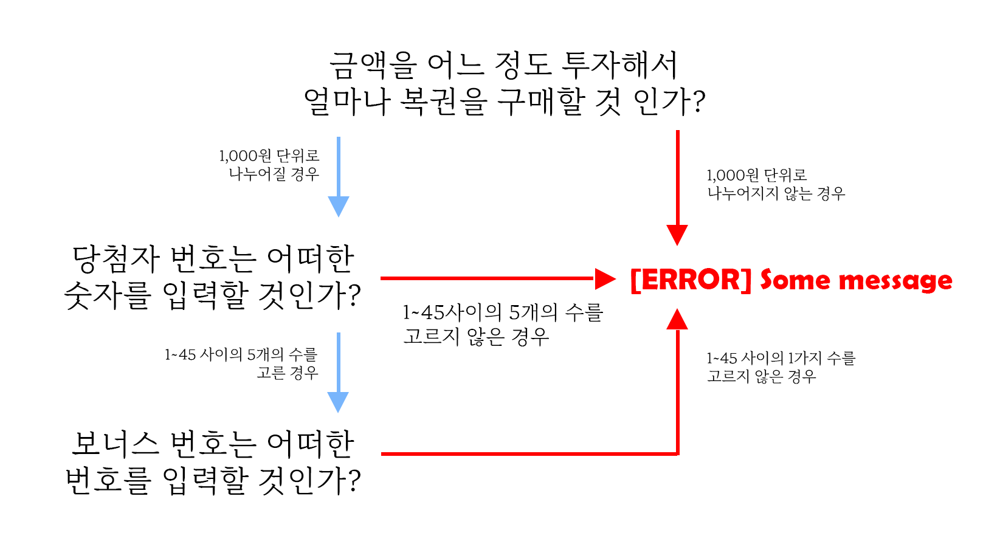

# 로또게임

## :file_folder: 조건

---

이번 로또 게임에서 우선 시 해야 하는 조건들을 나열할 필요가 있다.

> 1. 클래스(객체)를 분리하여 모듈화를 시도해 볼 것
>
> 2. 도메인 로직에 대한 단위 테스트를 작성해 볼 것

:open_file_folder: 우선 1번 조건에 대해서 정리해보자

```javascript
export default class Console {
  input(value) {}
  output(value) {}
}

---

import Console from "Console.js"

class App{
    constructor(){
        this.console = new Console();

        this.console.ipnut("some value");
        this.console.output("some value");
    }
}
```

1번 조건은 한 가지 객체에서 여러가지의 기능을 작성하여 가독성이 좋지 않게 코드를 작성하지 않는 것을 원하는 것이고 또한 여러가지 객체를 각 기능들에 맞는 적절한 이름을 선정하고 App에 기능들을 갖고와 어떠한 기능을 하는 App인지 한 눈에 알아볼 수 있게 만드는 것을 원하는 것이라 생각한다.

:open_file_folder: 다음은 2번 조건에 대해서 생각해봐야 한다.

> **도메인이란 무엇인가 :confused:?**
>
> 도메인 로직은 의사결정을 내릴 필요가 있는 역할을 수행하는 것들을 이야기 한다.

도메인은 **현실 세계의 문제** 를 해결하기 위한 소프트웨어의 역할이다.
도메인을 이야기 할 때는 기술적인 문제를 이야기 해서는 안된다. 소프트웨어의 속도를 향상 시키기 위해서는 어떠한 알고리즘을 써야하는지 등의 기술적인 문제를 고려하는 것은 서비스 로직의 문제이다.

### :file_folder: 도메인 로직을 고려한 기능 리스트

---



---
