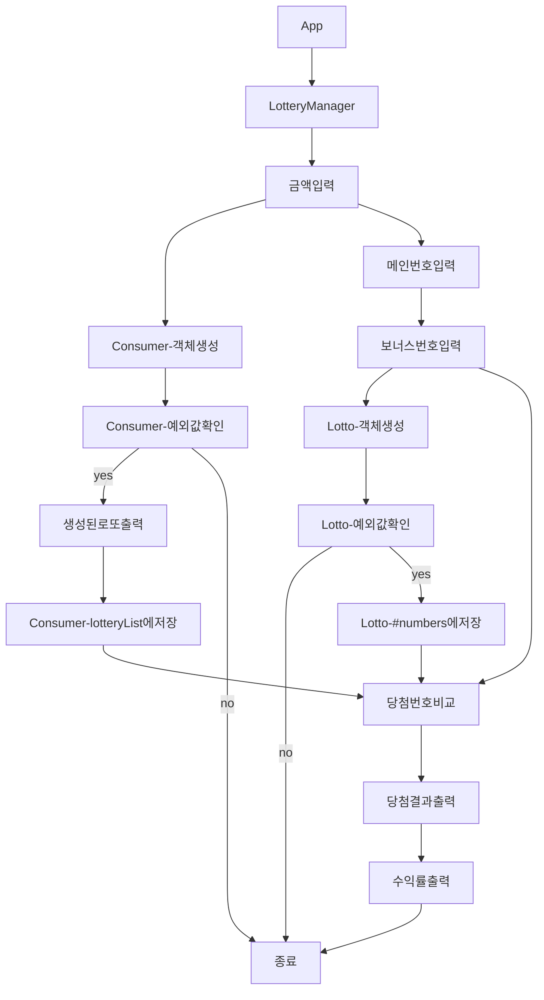

# 기능 목록

## 1. 구매자의 구매금액을 입력받고 해당 금액에 맞는 로또 생성

- 입력된 값을 바탕으로 / 1000 하여 장수 구하기
  - 입력이 정상적인지 체크하기
- 1 ~ 45번까지의 숫자 6개를 뽑기
  - 단, 뽑은 숫자들은 오름차순으로 정렬

## 2. 로또 메인번호 6자리, 보너스번호 1자리를 입력받아 당첨번호 생성

- 입력된 값을 바탕으로 당첨번호 생성하기
  - 입력이 정상적인지 체크하기 (중복과 같은 문제 체크할 것)

## 3. 당첨여부 확인

- 생성된 로또 번호와, 당첨번호를 비교하여 당첨여부 확인하기
  - 생성된 로또번호가 당첨번호를 몇개 포함하는지 카운트하기
  - 보너스번호와 메인번호 카운트는 별개로 카운트하기
  - 번호 일치 카운트를 바탕으로 N등상 당첨 개수를 저장하기

## 4. 당첨결과, 수익률 출력

- N등상 당첨 개수를 바탕으로 당첨 결과 출력하기
- 입력한 구매금액을 바탕으로 수익률 계산하여 출력하기
  - 수익률은 반올림하여 출력하기

## 5. 리팩토링

- 사용되는 상수들은 `Constants` 폴더 안에 기능별로 저장.
- 기존 `LotteryManager.js`에서 사용되던 print문, 당첨여부 확인 함수들은 `Utils` 폴더 내에 파일 분리하여 저장.
- `Consumer.js`, `Lotto.js`에서 사용되는 유효성 검사 함수들을 `Validation.js`로 분리하여 `Utils` 폴더 내에 저장.

# 기능 흐름

## Lotto

1. 유효성 검사
   - 당첨 번호를 , 단위로 구분했는지?
   - 당첨 번호가 6자리의 숫자가 맞는지?
   - 보너스번호가 1자리의 숫자가 맞는지?
   - 입력 숫자가 로또 범위 내에 있는지? (본 번호, 보너스 번호)
   - 당첨 번호에 중복이 존재하지는 않는지? (본 번호, 보너스 번호)
2. 당첨 확인
   - 몇개 맞췄는지?

## Consumer

1. 유효성 검사
   - 받아온 값이 숫자가 맞는지?
   - 값을 천원 단위로 입력했는지?
2. 로또 번호 생성
   - 받아온 money에 따라 로또 생성
3. 로또 번호 정렬
   - 로또 번호의 값을 오름차순으로 정렬
4. 로또 번호 출력
   - 생성한 로또들을 출력함

## LotteryManager

1. 게임 시작 기능
2. 구매금액 입력
3. 당첨번호 입력 (본 번호, 보너스 번호)
4. 로또 당첨여부 확인
5. 로또 당첨내역 출력
6. 수익률 출력
   - 수익률을 반올림해서 출력한다

# 요구 사항

- 프로그래밍 요구 사항에서 달리 명시하지 않는 한 파일, 패키지 이름을 수정하거나 이동하지 않는다.
- indent(인덴트, 들여쓰기) depth를 3이 넘지 않도록 구현한다. 2까지만 허용한다. 예를 들어 while문 안에 if문이 있으면 들여쓰기는 2이다.
  - 힌트: indent(인덴트, 들여쓰기) depth를 줄이는 좋은 방법은 함수(또는 메서드)를 분리하면 된다.
- 함수(또는 메서드)가 한 가지 일만 하도록 최대한 작게 만들어라.
- Jest를 이용하여 본인이 정리한 기능 목록이 정상 동작함을 테스트 코드로 확인한다.
- 함수(또는 메서드)의 길이가 15라인을 넘어가지 않도록 구현한다.
  - 함수(또는 메서드)가 한 가지 일만 잘 하도록 구현한다.
- else를 지양한다.
  - 힌트: if 조건절에서 값을 return하는 방식으로 구현하면 else를 사용하지 않아도 된다.
  - 때로는 if/else, switch문을 사용하는 것이 더 깔끔해 보일 수 있다. 어느 경우에 쓰는 것이 적절할지 스스로 고민해 본다.
- 도메인 로직에 단위 테스트를 구현해야 한다. 단, UI(Console.readLine, Console.print) 로직에 대한 단위 테스트는 제외한다.
- 핵심 로직을 구현하는 코드와 UI를 담당하는 로직을 구분한다.
- 단위 테스트 작성이 익숙하지 않다면 **tests**/LottoTest.js를 참고하여 학습한 후 테스트를 구현한다.
