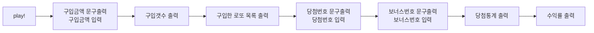

# 로또 기능 목록

## 🚀 기능 목록

- [ ] 구입금액문구 출력 및 입력
- [ ] 구입 갯수 출력
  - [ ] 구입 금액 1000원 당 로또 발행 1회이다.
- [ ] 구입한 로또 목록 출력
  - [ ] 1~45까지의 중복되지 않는 6자리의 숫자를 발행 횟수만큼 뽑는다.
  - [ ] 로또 발행 횟수 만큼 로또 번호 목록을 출력한다.
- [ ] 당첨번호 문구 출력 및 입력
- [ ] 보너스번호 문구 출력 및 입력
- [ ] 당첨통계 출력
  - [ ] 당첨번호와 뽑은 로또를 비교해 당첨 데이터를 구한다.
  - [ ] 당첨 데이터를 바탕으로 당첨 통계를 출력한다.
- [ ] 수익률 출력
  - [ ] 구입금액과 당첨금액을 활용해 수익률을 구해 출력한다.

## 흐름 파악

예외 사항은 일단 배제하였다.

흐름에 따른 기능을 나열하면 다음과 같다.

- 구입금액문구 출력 및 입력
- 구입 갯수 출력
- 구입한 로또 목록 출력
- 당첨번호 문구 출력 및 입력
- 보너스번호 문구 출력 및 입력
- 당첨통계 출력

각 과정에서 필요한 기능을 추가한다.

- 구입금액문구 출력 및 입력
- 구입 갯수 출력
  - 구입 금액 1000원 당 로또 발행 1회이다.
- 구입한 로또 목록 출력
  - 1~45까지의 중복되지 않는 6자리의 숫자를 발행 횟수만큼 뽑는다.
  - 로또 발행 횟수 만큼 로또 번호 목록을 출력한다.
- 당첨번호 문구 출력 및 입력
- 보너스번호 문구 출력 및 입력
- 당첨통계 출력
  - 당첨번호와 뽑은 로또를 비교해 당첨 데이터를 구한다.
  - 당첨 데이터를 바탕으로 당첨 통계를 출력한다.
- 수익률 출력
  - 구입금액과 당첨금액을 활용해 수익률을 구해 출력한다.
