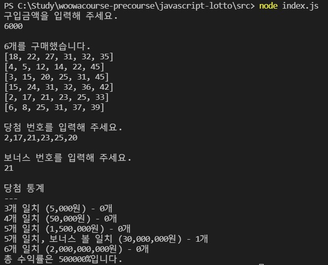

# 미션 - 로또

## 개요
본 프로그램은 로또 게임을 구현한다. 

로또의 구입 금액을 입력하면, 구입 금액에 해당하는 만큼 로또를 발행한다. 이후 당첨 번호와 보너스 번호를 입력받고, 당첨 내역과 수익률을 계산하여 출력해주는 프로그램이다.  

---

## 실행 화면
  

---

## 기능 목록

### 1. 사용자의 구입 금액 입력 (Test ✅)
    [✅] 사용자의 구입 금액 입력 기능
        [✅] 예외 : 로또 구입 금액이 1,000원으로 나누어 떨어지지 않는 경우
        [✅] 예외 : 로또 구입 금액이 숫자가 아닌 경우 (문자이거나, 공백 포함 등)
 
### 2. 구입 금액 만큼의 로또 발행 (Test ✅)
    [✅] 하나의 로또를 발행하는 기능
        [✅] 예외 : 발행한 로또의 갯수가 6이 아닌 경우
        [✅] 예외 : 발행한 로또의 각 숫자가 1-45까지의 범위를 벗어나는 경우
        [✅] 예외 : 발행한 로또가 숫자가 아닌 경우
        [✅] 예외 : 발행한 로또의 각 숫자가 중복되는 경우
    [✅] 사용자가 구매한 로또의 갯수만큼 로또를 생성
    [✅] 구매한 로또의 수량과 로또 번호를 출력하는 기능
        [✅] 로또 번호를 오름차순으로 정렬 (로또 내의 번호를 정렬)

### 3. 사용자의 당첨 번호, 보너스 번호 입력 (Test ✅)
    [✅] 사용자의 당첨번호, 보너스 번호 입력 기능
        [✅] 쉼표를 기준으로 구분
        [✅] 예외 : 구분 후의 원소 갯수가 6개가 아닌 경우
        [✅] 예외 : 구분 후의 원소가 모두 숫자가 아닌 경우
        [✅] 예외 : 구분 후의 원소에 중복되는 원소가 있는 경우
        [✅] 예외 : 보너스 번호가 1-9 사이의 범위가 아닌 경우
        [✅] 예외 : 보너스 번호가 숫자가 아닌 경우
### 4. 당첨 내역 계산 (Test ✅)
    [✅] 당첨 내역을 계산하는 기능
        [✅] 사용자가 구매한 로또 번호와 당첨 번호를 비교하여 당첨 내역을 비교
    [✅] 수익률을 계산하는 기능
        [✅] 소수점 둘째자리까지 반올림
    [✅] 당첨 내역과 수익률을 출력

####  모든 경우에 대해 사용자가 잘못된 값을 입력할 경우, throw문을 사용해 예외를 발생시키고, <code>"[ERROR]"</code>로 시작하는 에러메세지를 출력후 종료한다.   

---

## 클래스 설계
||App|User|Lotto|Calculator|
|---|------|---|---|---|
|field|totalLotto|amount lottoCount winningNumber bonusNumber|numbers|totalLotto yield winningNumber bonusNumber totalScore 
|method|play createUser generateLotto printLotto enterUserNumber enterBonusNumber printStatatics|userAmountException userWinningNumberException bonusNumberException parsingWinningNumber||calculateRank extractScore calcYield
---
 

## 클래스 상세 설명

#### 1. App
        play(): 프로그램의 전체 흐름을 담고 있다.
        createUser(): 입력받은 값을 가지고 사용자를 생성한다.
        generateLotto(): 사용자가 산 로또만큼 로또를 생성한다.
        printLotto(): 생성한 로또를 출력한다.
        enterUserNumber(): 당첨 번호를 입력받는다.
        enterBonusNumber(): 보너스 번호를 입력받는다.
        printStatatics(): 결과 통계값을 출력한다.

#### 2.User
        userAmountException(): 로또 구입 금액에 대한 예외처리를 진행한다.
        winningNumberException(): 당첨 번호에 대한 예외처리를 진행한다.
        bonusNumberException(): 보너스 번호에 대한 예외처리를 진행한다.
        parsingWinningNumber(): 당첨 번호를 , 기준으로 파싱한다.

#### 3. Calculator
        calculateRank(): 당첨번호와 로또를 비교하여 점수를 계산한다.
        extractScore(): 점수를 객체 형태로 변환한다.
        calcYield(): 전체 수익금을 계산한다.
 

---
## 환경
Node.js <code>v14.20.1</code>  

---
## 파일 목록

    C:. 
    │  📁 App.js
    │  📁 Calculator.js
    │  📁 index.js
    │  📁 Lotto.js
    │  📁 User.js
    │
    └─ 📁 utils
            📁 lottoException.js
            📁 numberException.js
            📁 userException.js
