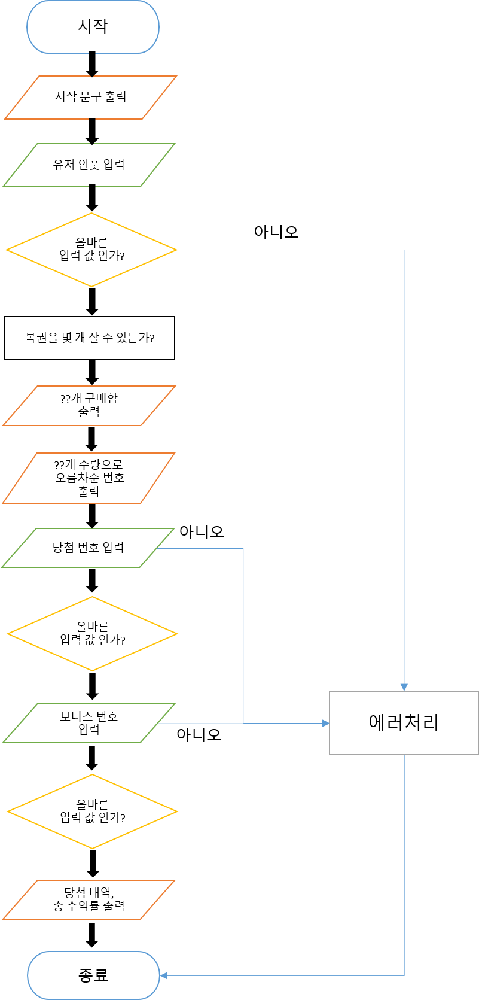

# ⚙ **기능 명세**

**[1]** ☑ 입력 문구 출력

- 출력 문구

```
구입금액을 입력해 주세요.
```

<br>

**[2]** ☑ 구입 금액 입력시 예외 처리

- 📌 입력 조건<br>
  1,000원 단위로 입력 받으며 1,000원으로 나누어 떨어지는 수.
  > 예외사항
- ✂ 1,000원으로 나누어 떨어지지 않는 경우
- ✂ 숫자가 아닌 경우
- ✂ 숫자에 문자가 포함된 경우

🚫 throw문 사용해 예외 발생🚫<br>
[ERROR]로 시작하는 에러메세지 출력 후 종료

<br>

**[3]** ☑ 구입금액에 따른 문구 출력

- 출력 문구

```html
<!-- ??는 구입금액에 따라 변경 -->
??개를 구매했습니다
```

<br>

**[4]** ☑ 로또갯수에 맞게 오름차순으로 번호 생성 후 출력 및 저장

- 출력 문구

```
[8, 21, 23, 41, 42, 43]
[3, 5, 11, 16, 32, 38]
[7, 11, 16, 35, 36, 44]
[1, 8, 11, 31, 41, 42]
[13, 14, 16, 38, 42, 45]
[7, 11, 30, 40, 42, 43]
[2, 13, 22, 32, 38, 45]
[1, 3, 5, 14, 22, 45]
```

<br>

**[5]** ☑ 입력 문구 출력

- 출력 문구

```
당첨 번호를 입력해 주세요.
```

<br>

**[6]** ☑ 당첨 번호 입력시 예외 처리

- 📌 입력 조건<br>
  1 ~ 45 까지의 중복되지 않는 수
  > 예외사항
- ✂ 중복된 수가 포함된 경우
- ✂ 숫자가 아닌 경우
- ✂ 숫자에 문자가 포함된 경우
- ✂ 1 ~ 45 까지의 숫자가 아닌 경우

🚫 throw문 사용해 예외 발생🚫<br>
[ERROR]로 시작하는 에러메세지 출력 후 종료

<br>

**[7]** ☑ 입력 문구 출력

- 출력 문구

```
보너스 번호를 입력해 주세요.
```

<br>

**[8]** ☑ 보너스 번호 입력시 예외 처리

- 📌 입력 조건<br>
  1 ~ 45 까지의 수 1개
  > 예외사항
- ✂ 숫자가 아닌 경우
- ✂ 숫자에 문자가 포함된 경우
- ✂ 1 ~ 45 까지의 숫자가 아닌 경우
- ✂ 숫자가 1개 이상인 경우

🚫 throw문 사용해 예외 발생🚫<br>
[ERROR]로 시작하는 에러메세지 출력 후 종료

<br>

**[9]** ☑ 당첨 내역 및 수익률 출력

- 출력 문구

```html
<!-- ??는 일치 갯수에 따라 변경 -->
3개 일치 (5,000원) - ??개 4개 일치 (50,000원) - ??개 5개 일치 (1,500,000원) -
??개 5개 일치, 보너스 볼 일치 (30,000,000원) - ??개 6개 일치 (2,000,000,000원) -
??개
<!-- ??.? 소수점 첫째 자리까지 -->
총 수익률은 ??.?%입니다.
```

<br>

# 📋 **로또 순서도**


