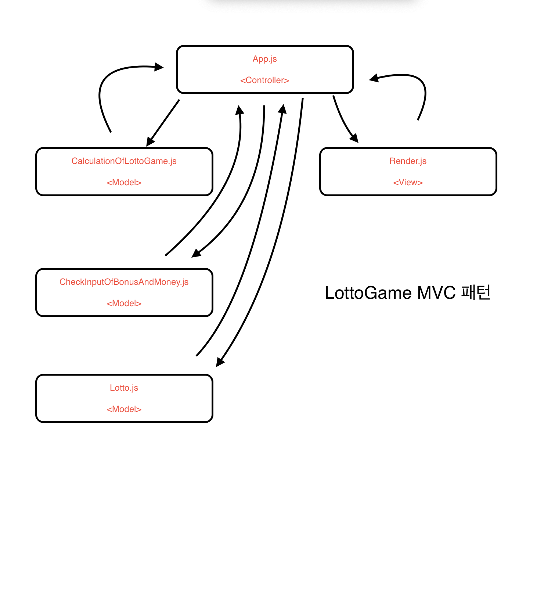

# 로또 게임 🎱

## 기능 목록 📚

1. 유저로부터 금액 입력받기 🔵

2. 입력값 타당성 검사 🔵

- 🚨 유저가 입력한 돈이 1000원 단위로 입력되지 않았을 때 에러 🔵
- 🚨 유자가 0이하의 값을 입력했을 때 에러 🔵

3. 입력값에 따라 "🟪 개 구매했습니다." 출력 🔵

4. 🟪 개의 중복없는 랜덤 배열 생성 및 출력 🔵

5. 유저로부터 당첨 번호 입력 받기 🔵

6. 입력값 타당성 검사 🔵

- 🚨 0이 입력 됐을 때 에러 🔵
- 🚨 ,이 연속으로 입렫됐을 때 에러 🔵
- 🚨 1~45 사이의 숫자를 입력하지 않았을 때 에러 🔵
- 🚨 당첨 번호를 6개 이상 입력했을 때 에러 🔵
- 🚨 당첨 번호에 중복이 있을 때 에러 🔵

7. 유저로부터 보너스 번호 입력받기 🔵

8. 입력값 타당성 검사

- 🚨 입력 된 보너스 번호가 1~45 사이가 아닐 때 에러 🔵
- 🚨 숫자를 입력하지 않았을 때 에러 🔵
- 🚨 당첨번호에 입력한 숫자를 보너스 번호에 입력했을 때 에러 🔵

9. 당첨번호, 보너스 번호와 입력값 비교 후 결과 도출 🔵

- 🚨 당첨된 숫자가 5개인 경우가 존재 할 경우 보너스 번호가 포함되어있는지 확인 🔵
- 🚨 포함 여부에 따라 2등, 3등 결정 🔵

10. 결과를 출력 🔵

11. 로또 결과에 따라 수익률 계산 및 출력 🔵

12. 인스턴스 종료 🔵

## 프로그래밍 요구 사항

1. package.json을 변경할 수 없고 외부 라이브러리(jQuery, Lodash 등)를 사용하지 않는다. 순수 Vanilla JS로만 구현한다. 🔵

2. JavaScript 코드 컨벤션을 지키면서 프로그래밍 한다. 🔵

3. 프로그램 종료 시 process.exit()를 호출하지 않는다. 🔵

4. 프로그램 구현이 완료되면 ApplicationTest의 모든 테스트가 성공해야 한다. 테스트가 실패할 경우 0점 처리한다. 🔵

5. 프로그래밍 요구 사항에서 달리 명시하지 않는 한 파일, 패키지 이름을 수정하거나 이동하지 않는다. 🔵

6. indent(인덴트, 들여쓰기) depth를 3이 넘지 않도록 구현한다. 2까지만 허용한다. 🔵

7. 예를 들어 while문 안에 if문이 있으면 들여쓰기는 2이다. 🔵

8. 함수(또는 메서드)가 한 가지 일만 하도록 최대한 작게 만들어라. 🔵

9. Jest를 이용하여 본인이 정리한 기능 목록이 정상 동작함을 테스트 코드로 확인한다. 🔵

10. 함수(또는 메서드)의 길이가 15라인을 넘어가지 않도록 구현한다. 🔺

-switch문을 사용하면서 15라인을 넘기는 함수가 발생하였다.

11. 함수(또는 메서드)가 한 가지 일만 잘 하도록 구현한다. 🔵

12. else를 지양한다. 🔵
    힌트: if 조건절에서 값을 return하는 방식으로 구현하면 else를 사용하지 않아도 된다.
    때로는 if/else, switch문을 사용하는 것이 더 깔끔해 보일 수 있다. 어느 경우에 쓰는 것이 적절할지 스스로 고민해 본다.

13. 도메인 로직에 단위 테스트를 구현해야 한다. 단, UI(Console.readLine, Console.print) 로직에 대한 단위 테스트는 제외한다.
    핵심 로직을 구현하는 코드와 UI를 담당하는 로직을 구분한다. 🔵

## MVC 패턴 🧩

## 게임결과🎱 gif

## 프리코스 소감 및 배운점 기록

[개인 블로그](https://velog.io/@tkdgk1996).

## 테스트 케이스 후기

2주차에서 Test코드에 많은 아쉬움을 가졌다. Test코드를 잘 다루지 못하는데 가장 먼저 테스트 코드를 짜기 시작하다 보니 시간에 쫓겨서 시간이 부족했던 거 같다. 그래서 3주차는 TDD를 모든 기능 구현이 끝난 후 실시해보기로 하였다. 이번주는 순서가 조금 바뀌었더라도 모든 코드들이 정상 작동한다고 생각했을 때 test 코드들을 작성하여 코드 테스트를 실행해보았다.

이번 3주차 미션에서는 UI 관련된 코드에 대한 test 는 요구사항에 없고 도메인 로직에 관한 테스트 코드 실행이 요구사항에 있었다.

실제 test코드를 작성하며 많은 함수의 오류를 발견하였고 이를 수정하며 테스트코드도 수정하는 경험을 했다. 테스트 코드를 작성하는 이유는 코드를 짜기 전 미리 오류를 방지하는 장치라고 생각했다. 하지만 원하는 코드를 짜고 난 후 테스트 코드를 짜도 오류를 발견하고 리펙토링에 많은 도움을 줄 수 있다는 것을 느꼈다. Test 코드를 짜면서 만들고자 하는 프로그램이 어떤 기능을 요하는지 더 자세히 이해할 수 있었다. 기능 목록은 더욱 세밀해졌고 내가 어떤 기능을 어디에 집어 넣는게 활용도가 높을지 분석할 수 있었다. TDD는 오류방지 뿐 아니라 짜고자 하는 프로그램의 기능 이해도를 높일 수 있다는 것을 경험했다.
