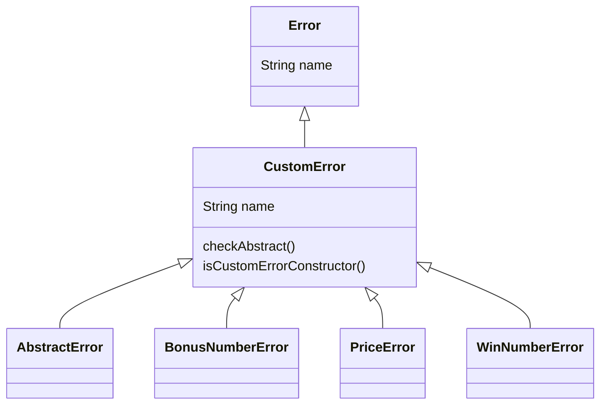
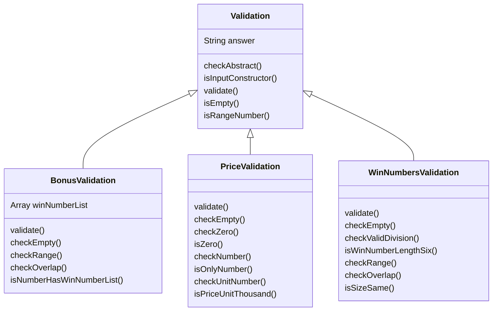
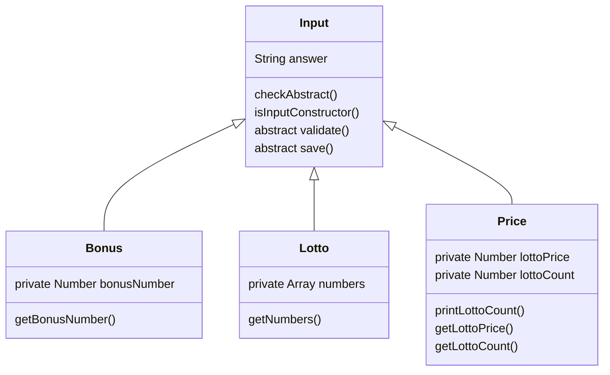
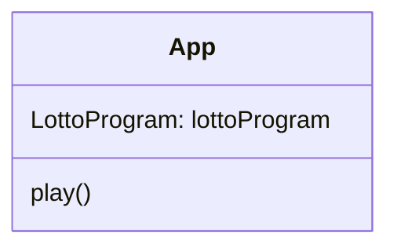
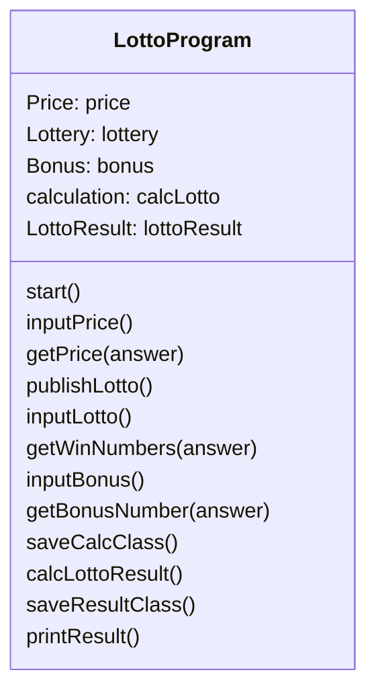
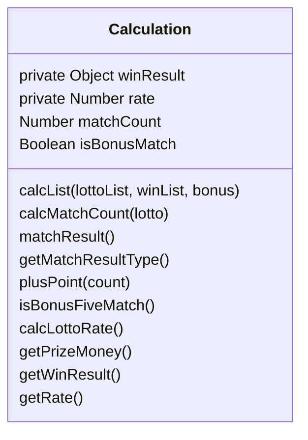
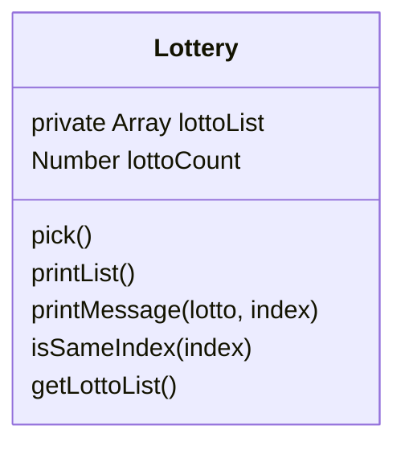
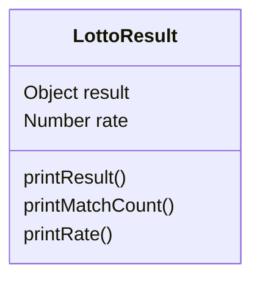

# 로또 프로그램 도큐먼트 📄

## 기능 목록 📝

1. 구입금액 입력문 출력
2. 구입금액 입력받기
   1. 1000원 단위의 금액
   2. 숫자인지 확인
3. 로또 번호 발행하기
   1. 로또 번호의 숫자 범위는 1부터 45까지
   2. 중복되지 않는 6개의 숫자
4. 로또 발행 개수 출력
5. 발행한 로또 출력
6. 당첨 번호 입력문 출력
7. 당첨 번호 입력받기
   1. 6개의 숫자
   2. 1 ~ 5 사이의 숫자
   3. 쉼표로 구분되어 있는 숫자
8. 보너스 번호 입력문 출력
9. 보너스 번호 입력받기
   1. 1 ~ 45 사이의 숫자
10. 당첨 기준을 토대로 점수 계산
    - 1등: 6개 번호 일치 / 2,000,000,000원
    - 2등: 5개 번호 + 보너스 번호 일치 / 30,000,000원
    - 3등: 5개 번호 일치 / 1,500,000원
    - 4등: 4개 번호 일치 / 50,000원
    - 5등: 3개 번호 일치 / 5,000원
11. 당첨 내역 출력
12. 수익률 계산
    1. 소수점 둘째 자리에서 반올림한다.
13. 수익률 출력

**예외사항 처리❗️**

- throw를 통하여 예외 반환
- 예외 상황에서는 에러 문구를 출력해야 함
- 에러 문구는 “[ERROR]”로 시작해야 함

### 폴더 구조 🗂

```
📦 src
 ┣ 📂 Error // 오류 관련 클래스
 ┃ ┣ 📜 AbstractError.js
 ┃ ┣ 📜 BonusNumberError.js
 ┃ ┣ 📜 CustomError.js
 ┃ ┣ 📜 PriceError.js
 ┃ ┗ 📜 WinNumberError.js
 ┣ 📂 Input // 입력 받는 당첨 번호, 보너스 번호, 구매 금액을 관리하는 클래스
 ┃ ┣ 📜 Bonus.js
 ┃ ┣ 📜 Lotto.js
 ┃ ┣ 📜 Price.js
 ┃ ┗ 📜 index.js
 ┣ 📂 Validation // 위의 입력값들의 유효성을 검사하는 클래스
 ┃ ┣ 📜 BonusValidation.js
 ┃ ┣ 📜 PriceValidation.js
 ┃ ┣ 📜 WinNumbersValidation.js
 ┃ ┗ 📜 index.js
 ┣ 📂 lib // 재사용성, 공공성 있는 상수 및 함수 정의
 ┃ ┣ 📜 Constants.js
 ┃ ┗ 📜 Utils.js
 ┣ 📜 App.js
 ┣ 📜 Calculation.js // 로또 번호 결과 계산 클래스
 ┣ 📜 Lottery.js // 로또 발행 클래스
 ┣ 📜 LottoProgram.js // 로또 프로그램의 전체적인 흐름 관리 클래스
 ┗ 📜 LottoResult.js // 로또 결과 출력 클래스
```

## 클래스 구조 🏡

**추상화 클래스**

### Error

> 예외 사항을 보면 에러 문구는 "[ERROR]" 라는 정해진 문구로 시작해야 한다는 규칙이 있었습니다. 처음
> 에는 모든 오류 메시지를 "[ERROR] 유효하지 않은 값입니다." 처럼 "[ERROR]"를 붙인 메시지로 선언을 할
> 까 고민하다가 따로 Error 클래스를 상속받는 CustomError (추상)클래스를 정의하고 그곳에서 "[ERROR]"
> 를 붙여주면 오류 메시지를 상수로 선언할 때 "[ERROR]"를 붙이지 않을 수 있어서 구현을 해보았습니다.

**함께 읽어보면 좋을 것 같은 문서링크**
[커스텀 에러와 에러 확장](https://ko.javascript.info/custom-errors)

<br/><br/>



<br/><br/>

### Validation

> 저번 2주차 미션 때와 같이 Validation이라는 클래스를 따로 만들어 구현을 하려고 생각 했지만 이번 미
> 션에는 입력을 받는 값이 다양했기 때문에 그만큼 유효성 검사를 다양하게 해주어야 했습니다. 그래서 공
> 통적으로 검사해야하는 유효성 검사를 묶어 Validation이라는 (추상)클래스를 정의했습니다. 또한 입력받
> 는 값들 3가지에 대한 유효성 검사 클래스를 정의하였고 Validation을 상속받게 하였습니다.

<br/><br/>



<br/><br/>

### Input

> 이번 미션에서는 로또 구입 가격, 로또 당첨번호, 로또 보너스 번호 이렇게 3가지의 값을 입력을 받아야
> 하는 플로우가 있습니다. 처음에는 LottoConstoller 클래스에서 관리를 하려 했지만 중간 중간 유사한 코
> 드들이 반복되는 것이 보여 Input이라는 (추상)클래스를 정의하고 이를 상속받는 자식클래스 각각 Price,
> Lotto, Bonus 클래스로 분리하였습니다.

<br/><br/>



**기본 클래스**

<br/><br/>

### App

<br/><br/>



<br/><br/>

### LottoProgram

<details>
    <summary>함수 설명</summary>
    <div markdown="1">
      <pre>
        - start: 프로그램 시작
        - inputPrice: readLine 함수를 통해서 로또 구매 금액을 입력받는 함수
        - getPrice: 금액을 Price 클래스로 넘겨 유효성 검사 및 데이터 저장 함수
        - publishLotto: Lottery 클래스를 통해 로또를 개수만큼 발행/출력하는 함수
        - inputLotto: readLine 함수를 통해서 당첨번호를 입력받는 함수
        - getWinNumbers: 당첨번호를 Lotto 클래스로 넘겨 유효성 검사 및 데이터 저장 함수
        - inputBonus: readLine 함수를 통해서 보너스 번호를 입력받는 함수
        - getBonusNumber: 보너스 번호를 Bonus 클래스로 넘겨 유효성 검사 및 데이터 저장 함수
        - saveCalcClass: Calculation 객체 생성 함수
        - calcLottoResult: 발행한 로또 리스트, 당첨 번호, 보너스 번호, 로또 금액 등을 넘겨 결과를 계산하는 함수
        - saveResultClass: 계산한 결과를 출력하기 위해 LottoResult 객체를 생성하는 함수
        - printResult: 결과값 출력 함수
      </pre>
    </div>
</details>

<br/><br/>



<br/><br/>

### Calculation

<details>
    <summary>함수 설명</summary>
    <div markdown="1">
      <pre>
        - calcList: 프로그램 시작
        - calcMatchCount: 로또번호와 당첨번호를 비교하여 일치하는 개수를 계산하는 함수
        - matchResult: 개수를 구하고 점수 부여 함수를 호출하는 함수
        - getMatchResultType: isBonusFiveMatch 조건을 통해 bonus OR matchCount를 반환하는 함수
        - plusPoint: 일치하는 타입에 점수를 추가하는 함수
        - isBonusFiveMatch: 보너스 포함 5개 일치일 경우 확인하는 함수
        - calcLottoRate: 수익률 계산 함수
        - getPrizeMoney: 당첨금 계산 및 반환 함수
        - getWinResult: 멤버변수 winResult 반환 함수
        - getRate: 멤버변수 rate 반환 함수
      </pre>
    </div>
</details>

<br/><br/>



<br/><br/>

### Lottery

<details>
    <summary>함수 설명</summary>
    <div markdown="1">
      <pre>
        - pick: 1부터 45까지의 중복되지 않는 숫자 3개를 발행하여 오름차순으로 배열에 추가하는 함수
        - printList: 발행한 함수를 forEach문으로 돌면서 printMessage 호출하는 함수
        - printMessage: 각 로또를 규격에 맞게 출력하는 함수
        - isSameIndex: index가 발행한 로또 개수랑 같은지 확인하는 함수
        - getLottoList: 발행한 로또들을 반환하는 함수
      </pre>
    </div>
</details>

<br/><br/>



<br/><br/>

### LottoResult

<details>
    <summary>함수 설명</summary>
    <div markdown="1">
      <pre>
        - printResult: "당첨 통계"출력 및 결과값 출력함수를 호출하는 함수
        - printMatchCount: 결과를 출력하는 함수
        - printRate: 수익률을 출력하는 함수
      </pre>
    </div>
</details>

<br/><br/>


