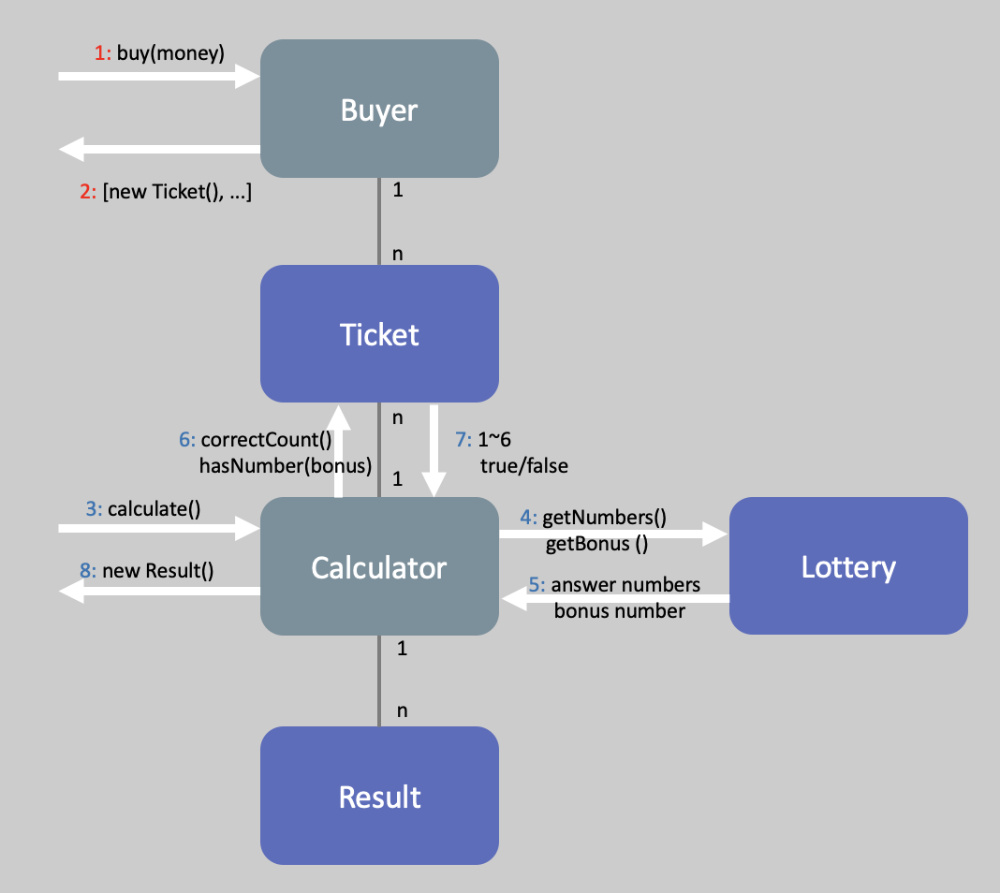

## 도메인 설계
<figure style="margin: 1rem auto; max-width: 30rem;">
    
    <figcaption style="text-align:center; font-size:0.8em; color:gray;">도메인 설계</figcaption>
</figure>

## 구현할 목록

#### 도메인(Model)
- [x] Ticket (티켓에 해당하는 가격 1000원을 알려준다)
- [x] Lotto (입력받은 당첨 숫자들 값을 확인한다)
- [x] Buyer (구입 금액에 해당하는 만큼 로또를 발행해야 한다)
- [ ] Result (비교 결과 및 수익률을 알려준다)
- [ ] Calculator (Tiket과 Lotto를 비교해서 Result를 반환한다.)

#### View
- [ ] "구입금액을 입력해 주세요."
- [ ] "8개를 구매했습니다."
- [ ] "당첨 번호를 입력해 주세요."
- [ ] "보너스 번호를 입력해 주세요."
- [ ] "당첨 통계"

#### Controller
- [ ] 예외처리
- [ ] Model과 View 연결

## 기능 요구 사항
1. 로또 구입 금액을 입력하면 구입 금액에 해당하는 만큼 로또를 발행해야 한다.
2. 로또 1장의 가격은 1,000원이다.
3. 당첨 번호와 보너스 번호를 입력받는다.
4. 사용자가 구매한 로또 번호와 당첨 번호를 비교하여 당첨 내역 및 수익률을 출력하고 로또 게임을 종료한다.
5. 사용자가 잘못된 값을 입력할 경우 throw문을 사용해 예외를 발생시키고, "[ERROR]"로 시작하는 에러 메시지를 출력 후 종료한다.
