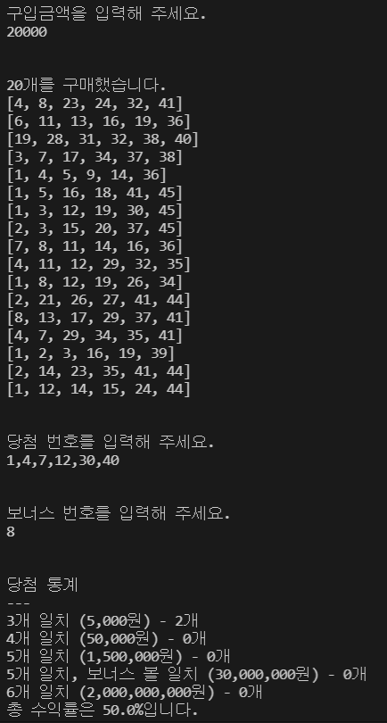

## 🔖 웹 프론트엔드 프리코스 3주 차 미션 - 로또 게임

    1. 1장 당 1000원인 로또의 구입 금액을 입력 받아 해당하는 만큼 로또를 발행한다.
    2. 당첨 번호와 보너스 번호를 입력 받는다.
    3. 사용자가 구매한 로또 번호와 당첨 번호를 비교하여 당첨 내역 및 수익률을 출력한다.

#### 규칙

```
- 로또 번호의 숫자 범위는 1~45까지이다.
- 1개의 로또를 발행할 때 중복되지 않는 6개의 숫자를 뽑는다.
- 당첨 번호 추첨 시 중복되지 않는 숫자 6개와 보너스 번호 1개를 뽑는다.
- 당첨은 1등부터 5등까지 있다. 당첨 기준과 금액은 아래와 같다.
    - 1등: 6개 번호 일치 / 2,000,000,000원
    - 2등: 5개 번호 + 보너스 번호 일치 / 30,000,000원
    - 3등: 5개 번호 일치 / 1,500,000원
    - 4등: 4개 번호 일치 / 50,000원
    - 5등: 3개 번호 일치 / 5,000원
```

#### 예시

```
구입금액을 입력해 주세요.
8000

8개를 구매했습니다.
[8, 21, 23, 41, 42, 43]
[3, 5, 11, 16, 32, 38]
[7, 11, 16, 35, 36, 44]
[1, 8, 11, 31, 41, 42]
[13, 14, 16, 38, 42, 45]
[7, 11, 30, 40, 42, 43]
[2, 13, 22, 32, 38, 45]
[1, 3, 5, 14, 22, 45]

당첨 번호를 입력해 주세요.
1,2,3,4,5,6

보너스 번호를 입력해 주세요.
7

당첨 통계
---
3개 일치 (5,000원) - 1개
4개 일치 (50,000원) - 0개
5개 일치 (1,500,000원) - 0개
5개 일치, 보너스 볼 일치 (30,000,000원) - 0개
6개 일치 (2,000,000,000원) - 0개
총 수익률은 62.5%입니다.
```

<br/>

### 🔨 구현할 기능 목록

#### ⌨️ 입력

- ✅ 구입 금액 입력받기
  - ✅ ⛔ [ERROR] : 1,000원으로 나누어 떨어지지 않는 경우
  - ✅ ⛔ [ERROR] : 숫자가 아닌 문자가 들어오는 경우
- ✅ 당첨 번호 입력받기
  - ⛔ [ERROR]
    - ✅ 6개의 숫자를 입력하지 않은 경우
    - ✅ 로또 번호의 숫자 범위인 1~45를 벗어난 경우
    - ✅ 숫자가 아닌 문자를 입력한 경우
    - ✅ 중복이 존재하는 경우
- ✅ 보너스 번호 입력받기
  - ⛔ [ERROR]
    - ✅ 로또 번호의 숫자 범위인 1~45를 벗어난 경우
    - ✅ 숫자가 아닌 문자를 입력한 경우
    - 당첨 번호에 보너스 번호가 이미 존재하는 경우

#### 💻 출력

- ✅ 로또 수량 출력하기
  ✅ 로또 번호 출력하기
  - 정렬: 오름차순
- ✅ 당첨 내역 출력하기
- ✅ 수익률 출력하기

#### 💡 핵심 로직

- ✅ 로또 수량 구하기
  - `구입 금액을 로또 1장의 가격인 1,000원 단위로 나누는 기능`
- ✅ 로또 번호 생성하기
  - `반환 타입`: 배열
  - `범위`: 1~45
  - `갯수`: 6개
  - `중복 여부`: 불가능
- ✅ 사용자가 입력한 당첨 번호를 쉼표(,) 기준으로 구분하기
- ✅ 사용자가 구매한 로또의 번호와 당첨 번호 비교하기
  - ✅ `각 로또의 등수 구하기`
- ✅ 사용자가 구매한 로또의 총 당첨 금액 구하기
- ✅ 수익률 구하기
    - `소수점 둘째 자리에서 반올림하는 기능`

<br/>

#### 🪄 실행 결과

;
