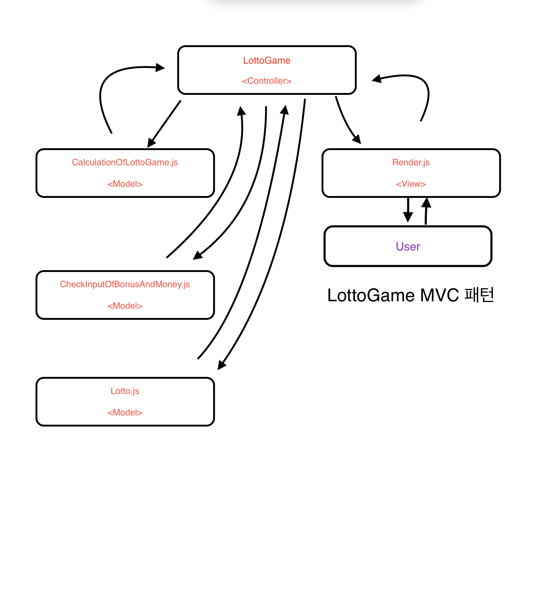

# 로또 게임 🎱

## 기능 목록 📚

1. 유저로부터 금액 입력받기

2. 입력값 타당성 검사

- 🚨 유저가 입력한 돈이 1000원 단위로 입력되지 않았을 때 에러
- 🚨 유자가 0이하의 값을 입력했을 때 에러

3. 입력값에 따라 "🟪 개 구매했습니다." 출력

4. 🟪 개의 중복없는 랜덤 배열 생성 및 출력

5. 유저로부터 당첨 번호 입력 받기

6. 입력값 타당성 검사

- 🚨 0이 입력 됐을 때 에러
- 🚨 ,이 연속으로 입렫됐을 때 에러
- 🚨 1~45 사이의 숫자를 입력하지 않았을 때 에러
- 🚨 당첨 번호를 6개 이상 입력했을 때 에러
- 🚨 당첨 번호에 중복이 있을 때 에러

7. 유저로부터 보너스 번호 입력받기

8. 입력값 타당성 검사

- 🚨 입력 된 보너스 번호가 1~45 사이가 아닐 때 에러
- 🚨 숫자를 입력하지 않았을 때 에러
- 🚨 당첨번호에 입력한 숫자를 보너스 번호에 입력했을 때 에러

9. 당첨번호, 보너스 번호와 입력값 비교 후 결과 도출

- 🚨 당첨된 숫자가 5개인 경우가 존재 할 경우 보너스 번호가 포함되어있는지 확인

- 🚨 포함 여부에 따라 2등, 3등 결정

10. 결과를 출력

11. 로또 결과에 따라 수익률 계산 및 출력

## MVC 패턴 🧩

## 게임결과🎱 gif

## 프리코스 소감 및 배운점 기록

[개인 블로그](https://velog.io/@tkdgk1996).
